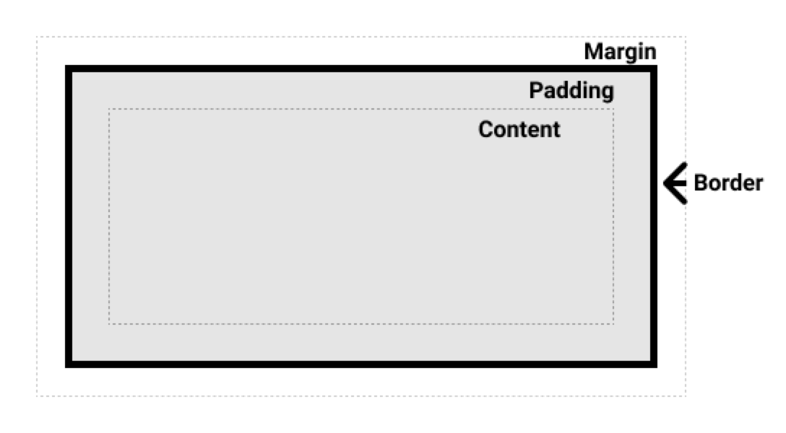
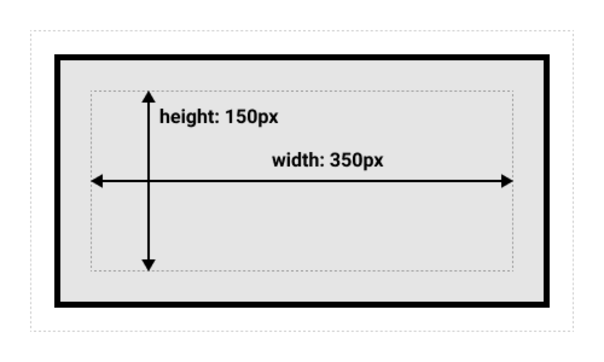
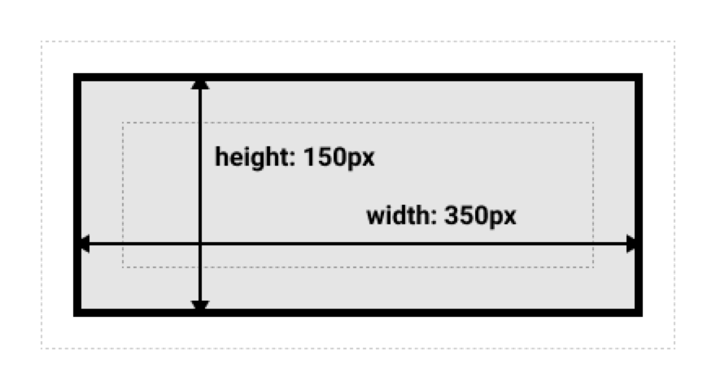

## 什么是盒模型

> 完整的 CSS 盒模型应用于块级盒子，内联盒子只使用盒模型中定义的部分内容。模型定义了盒的每个部分 —— margin, border, padding, and content —— 合在一起就可以创建我们在页面上看到的内容。为了增加一些额外的复杂性，有一个标准的和替代（IE）的盒模型。

## 组成部分

-   Content box: 这个区域是用来显示内容，大小可以通过设置 width 和 height.
-   Padding box: 包围在内容区域外部的空白区域； 大小通过 padding 相关属性设置。
-   Border box: 边框盒包裹内容和内边距。大小通过 border 相关属性设置。
-   Margin box: 这是最外面的区域，是盒子和其他元素之间的空白区域。大小通过 margin 相关属性设置。



## 标准盒模型

在标准模型中，如果你给盒设置 `width` 和 `height`，实际设置的是 `content box`。 `padding` 和 `border` 再加上设置的宽高一起决定整个盒子的大小。 见下图。

假设定义了 width, height, margin, border, and padding

> ```
> .box {
>   width: 350px;
>   height: 150px;
>   margin: 25px;
>   padding: 25px;
>   border: 5px solid black;
> }
> ```

如果使用标准模型宽度 = 410px (350 + 25 + 25 + 5 + 5)，高度 = 210px (150 + 25 + 25 + 5 + 5)，padding 加 border 再加 content box。



> 注: margin 不计入实际大小 —— 当然，它会影响盒子在页面所占空间，但是影响的是盒子外部空间。盒子的范围到边框为止 —— 不会延伸到 margin。

## 怪异盒模型（IE）

你可能会认为盒子的大小还要加上边框和内边距，这样很麻烦，而且你的想法是对的! 因为这个原因，css 还有一个替代盒模型。使用这个模型，所有宽度都是可见宽度，所以内容宽度是该宽度减去边框和填充部分。使用上面相同的样式得到 (width = 350px, height = 150px).



默认浏览器会使用标准模型。如果需要使用替代模型，您可以通过为其设置 `box-sizing: border-box` 来实现。 这样就可以告诉浏览器使用 `border-box` 来定义区域，从而设定您想要的大小。

> 注： 一个有趣的历史记录 ——Internet Explorer 默认使用替代盒模型，没有可用的机制来切换。（译者注：IE8+ 支持使用 box-sizing 进行切换 ）
