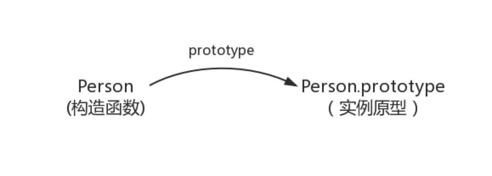

## prototype

每个函数都有一个 prototype 属性，就是我们经常在各种例子中看到的那个 prototype ，比如：

```
function Person() {

}
// 虽然写在注释里，但是你要注意：
// prototype是函数才会有的属性
Person.prototype.name = 'Kevin';
var person1 = new Person();
var person2 = new Person();
console.log(person1.name) // Kevin
console.log(person2.name) // Kevin
```

那这个函数的 prototype 属性到底指向的是什么呢？是这个函数的原型吗？

其实，函数的 prototype 属性指向了一个对象，这个对象正是调用该构造函数而创建的实例的原型，也就是这个例子中的 person1 和 person2 的原型。

那什么是原型呢？你可以这样理解：每一个 JavaScript 对象(null 除外)在创建的时候就会与之关联另一个对象，这个对象就是我们所说的原型，每一个对象都会从原型"继承"属性。

让我们用一张图表示构造函数和实例原型之间的关系：



在这张图中我们用 Object.prototype 表示实例原型。

那么我们该怎么表示实例与实例原型，也就是 person 和 Person.prototype 之间的关系呢，这时候我们就要讲到第二个属性

## _proto_

这是每一个 JavaScript 对象(除了 null )都具有的一个属性，叫\_\_proto\_\_，这个属性会指向该对象的原型。

## 原型链

理解原型链的基础，首先要理解，原型、实例、构造函数名词的意思

当读取实例的属性时，如果找不到，就会查找与对象关联的原型中的属性，如果还查不到，就去找原型的原型，一直找到最顶层（当查找到 Object.prototype）为止。

原型链的最顶层则是 `Obejct.prototype`，`Object.prototype` 的原形则是 `null`

## 原型继承

```
function Parent() {
    this.name = '123'
}

Parent.prototype.getName = function() {
    console.log(this.name);
}

function Child() {}

Child.prototype = new Parent();

var child = new Child();

child.getName();
```

优点

-   简单

缺点

-   引用类型的属性被所有示例共享
-   在创建实例时，不能向父实例传参

## 寄生组合继承

```
function Parent(name) {
    this.name = name;
}

Parent.prototype.getName = function() {
    console.log(this.name);
}

function Child(name, age) {
    Parent.call(this, name);
    this.age = age;
}

Child.prototype = new Parent();

var child1 = new Child('faker', 18);
console.log(child1);
```

优点

-   这种方式的高效率体现它只调用了一次 Parent 构造函数，并且因此避免了在 Parent.prototype 上面创建不必要的、多余的属性。与此同时，原型链还能保持不变；因此，还能够正常使用 instanceof 和 isPrototypeOf。开发人员普遍认为寄生组合式继承是引用类型最理想的继承范式。

缺点

-   寄生组合继承最大的缺点是会调用两次父构造函数。
